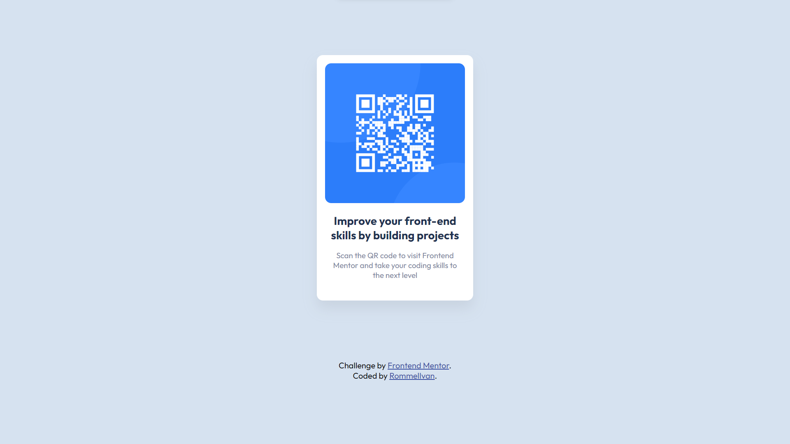

# Frontend Mentor - QR code component solution

This is a solution to the [QR code component challenge on Frontend Mentor](https://www.frontendmentor.io/challenges/qr-code-component-iux_sIO_H). Frontend Mentor challenges help you improve your coding skills by building realistic projects. 

## Table of contents

- [Overview](#overview)
  - [Screenshot](#screenshot)
  - [Links](#links)
- [My process](#my-process)
  - [Built with](#built-with)
  - [What I learned](#what-i-learned)
  - [Continued development](#continued-development)
  - [Useful resources](#useful-resources)
- [Author](#author)

## Overview

### Screenshot



### Links

- Solution URL: (https://github.com/RommelIvan/qr-code-component-challenge)
- Live Site URL: (https://RommelIvan.github.io/qr-code-component-challenge)

## My process

### Built with

- Semantic HTML5 markup
- Flexbox

### What I learned

Because using div tags is messy, I had to learn how to utilize Semantic HTML5 Markup.

```html
<article>
  This is Good
</article>
```

I also learnt how to organize the footer and QR Code Card using flexbox, as well as how to center the QR Code Card.

```css
/* QR Code Card and Footer */
body {
  display: flex;
  justify-content: center;
  align-items: center;
  flex-direction: column;
}

/* Inside the QR Code Card, Image and Texts */
article {
  display: flex;
  justify-content: center;
  align-items: center;
  flex-direction: column;
}
```

### Continued development

This design might be great for my future projects, like a QR Code generator.

### Useful resources

- [Interneting Is Hard](https://www.internetingishard.com/html-and-css/) - A Friendly Web Development Tutorial for Complete Beginners, Helped me on learning the basics of Frontend Development.

## Author

- GitHub - [RommelIvan](https://www.github.com/RommelIvan)
- Frontend Mentor - [@RommelIvan](https://www.frontendmentor.io/)
